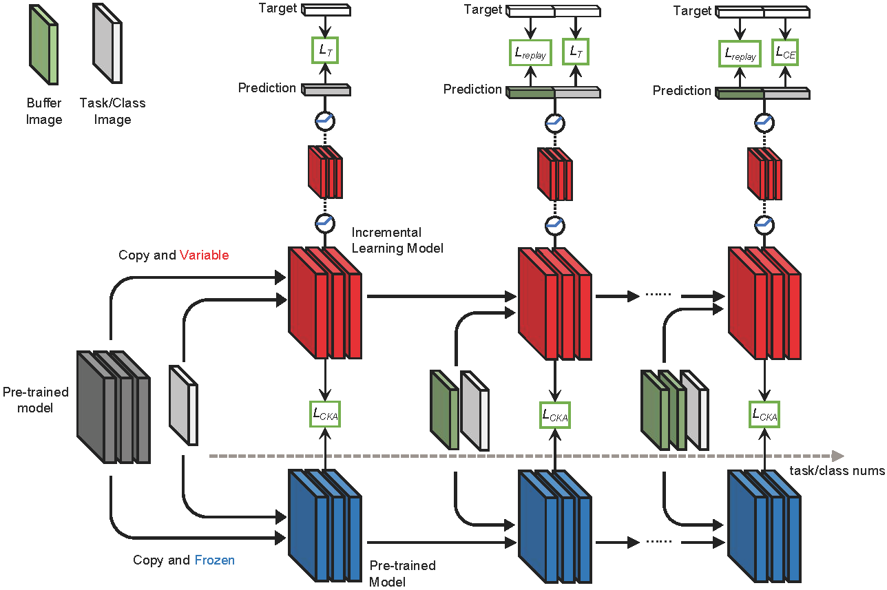

<h1 align="center">
Continuous Transfer of Neural Network Representational Similarity for Incremental Learning 
</h1>

  

## Instructions

- use `main.py` to launch an experiment.
- New models can be added to the `models/` folder.
- New datasets can be added to the `datasets/` folder.

## Usage 
For example:
- `python main.py --dataset seq-cifar10 --model pmkd --alpha 1 --beta 1 --cka 1 --n_epochs 50 --buffer_size 500 --lr 0.01 --batch_size 96 --pre_dataset tinyimgR --minibatch_size 48`
- `python main.py --dataset seq-imageneta --model pmkd --alpha 1 --beta 1 --cka 1 --n_epochs 50 --buffer_size 10000 --lr 0.01 --batch_size 16 --pre_dataset imagenetB --minibatch_size 16`

Powered by [Mammoth](https://github.com/aimagelab/mammoth)